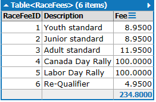
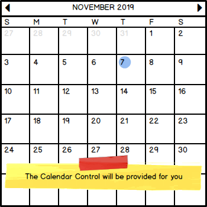
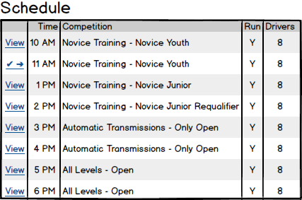
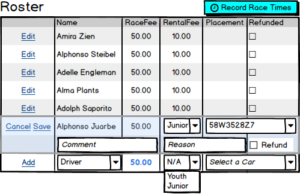
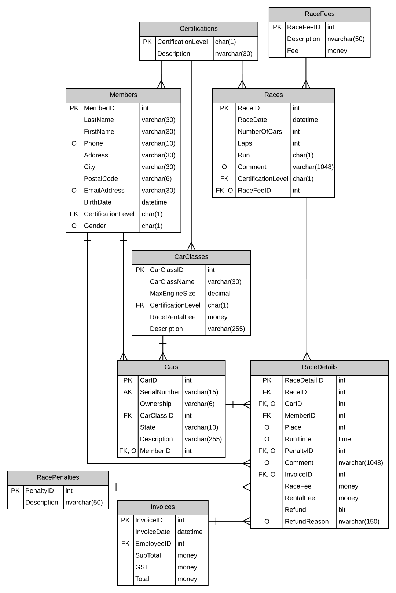

# Racing Subsystem 

> *Employees must log onto the system to access the Racing subsystem. The Racing Subsystem must only allow authenicated users within the **Race Coordinator** Role to have access to this subsystem. The Employee full name must appear somewhere on the form.*

## Business Process Overview

Members of eRace can register for upcoming races. Races are run every weekend but long weekends are treated as special **competition races** because they include prizes for the race winners. There are flat fees for registering in a race, and those are set out in the `Race.RaceFeeID` column of the database. Members can register for races any time before the race. The only exceptions are the semi-finals and finals for competition races - members must be in the top set of winners for the prior race in order to compete in the semi-finals and finals.

The dates, certification levels and applied fees for each race are set up by the Director in a different subsystem of the application. Your task here is to only handle [Registrations](#registrations) and [Race Results](#recording-race-results).

### Registrations

Members can register for races anytime before the race has run, provided there is an opening for the race. Limits to the number of cars allowed in the race is set in the `Races` table. Race fees are payable at the time of registration, but rental fees can be left to the day of the race.

The employee starts the registration by selecting a date on the racing calendar (this control is given to you - see your instructor for details). Selecting the date will display the schedule for that day.

The day's racing schedule must display the races for that day in order of the time that the race occurs. Time should be normalized to the common AM/PM time slot. From the schedule, the employee may select a specific race to view.

The race's Roster is where new drivers are added and changes are made for existing drivers. It also displays a [button to go to the page](#recording-race-results) where the race times can be recorded.

When a new driver is added, they must pay the Race Fee at that time, and an invoice is generated for the registration.<!-- They may also select a rental car at the time they are added, but rental information can be left empty until the day of the race.-->

> Currently, drivers must rent cars from us for races due to insurance concerns. In the future, both rentals and member cars will hopefully be allowed.

On the day of the race, driver information for the roster is be edited to allow the driver to rent a car (using a cascading drop-down of the car class and car VIN). <!--Rentals are optional, as some members bring/store their own vehicles for the races.--> Vechicles cannot be double-booked for the race. It's also permissible for the driver to cancel; a reason must be provided for the refund to be applied. When a refund is applied, the driver is scratched from the race (see the `RacePenalty` table).

### Recording Race Results

The Race Results page is linked to from the Registration page. When a race is completed, the race coordinator will enter the times for the drivers and apply any penalties that occurred during the race. Race times are not entered for drivers who have been scratched from the race.

Saving the race times is performed as a bulk operation - all the drivers' times/penalties are saved in the same transaction. Race times can be edited after they have been previously saved, but clicking the **Save Times** button in this case should present the user with a dialog confirming that they want to over-write the previously recorded race times.

## Business Rules

- Registering a new driver for a race:
  - All processing must be done as a single transaction.
  - An invoice must be generated as part of the registration.
  - The race fee is payable at this time and must be recorded as part of the race details.
  - Members cannot be double-registered in a given race.
  - Vehicle rental can be done at this time, but drivers can rent at a later time.
  - Vehicles must fit into the matching certification level that is specified by the `Races` table.
- Editing a registration:
  - Vehicles must fit into the matching certification level that is specified by the `Races` table.
  - Refunds must be accompanied by a reason.
- Recording race results:
  - All processing must be done as a single transaction.
  - Race times cannot be negative.
  - Drivers that have been scratched are given a race time of zero.
  - The drivers' places in the race must be calculated in the BLL and stored along with the race times.
  - Penalties don't affect the driver's place in the race; only the race time that has been entered affects their placement. Assume the times have been adjusted correctly by the Race Coordinator for penalties at the time they were entered by the user.

----

## ERD

The Racing subsystem uses the following tables in the database. Note that references to `EmployeeID` should be resolved against the logged-in user.

