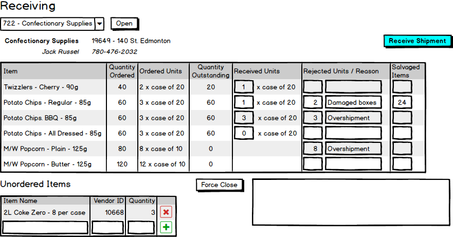
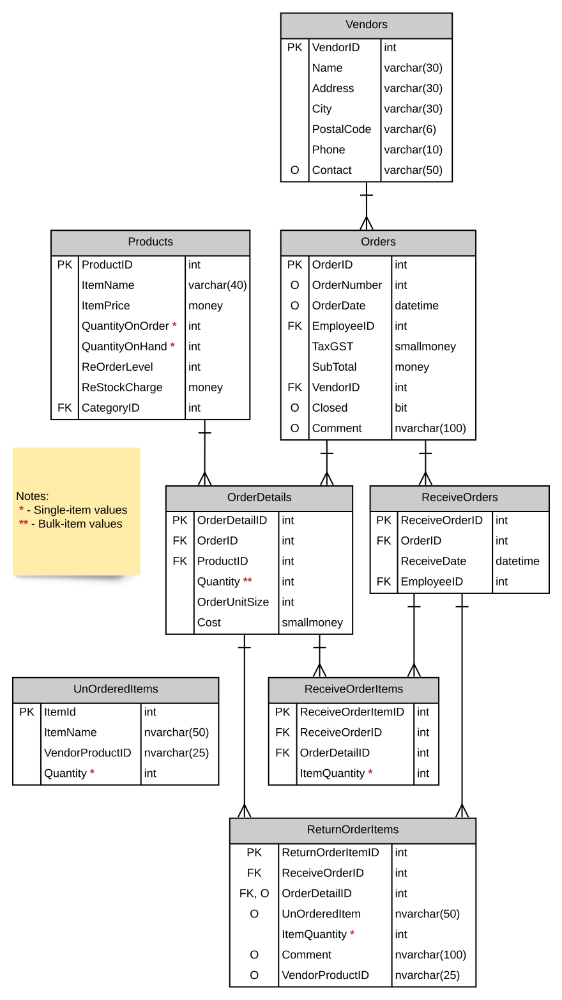

# Receiving Subsystem 

## Business Processes

> *Employees must log onto the system to access the Racing subsystem. Receiving must only allow authenicated users within the **Clerk** or **Food Service** Roles to have access to this subsystem. The Employee full name must appear somewhere on the form.*

Inventory is re-stocked through receiving items ordered from vendors. The receiving process begins with selecting an active PO from the vendor (an "active" PO is one where the order's `Closed` is `false` and values exist for the `OrderNumber` and `OrderDate`).

Stock was ordered according to a unit size (e.g.: *1 each* or *10 per case*), so the expected number of items should be the product of the `Quantity` and the `OrderUnitSize`. For example, 3 cases of potato chips (20/case) means that we have ordered 60 bags of chips.

Occasionally, a shipment will include un-ordered or damaged items. Un-ordered and damaged items are treated differently. Damaged items are inspected and, in the case of bulk shipments, partially received. For example, if a case of 20 potato chips was partially crushed in shipment and two of the bags inside are damaged (perhaps cut or popped) while the rest are okay, then we would want to receive a quantity of 18. The damaged items are set aside to be returned later. In the case of overshipments, the overshipped products are also set aside to be returned.

Items not on the original PO are simply identified and returned. 

A receiver can also Force Close an order (this is a management decision). A Force Close is used when the outstanding order will not be fullfilled by the supplier for one reason or another, such as the supplier has gone out of business or the product is no longer available or produced. A reason must be supplied for the force-closure (e.g.: "Shipped in error").

After either Receiving or Force Close, refresh the display so a new order can be selected from the outstanding list of orders.

Use the following rules for processing this form.

- Only active POs are listed for the employee to select; show the Order Number and the vendor name in the selection.
- When a PO is selected for receiving,
  - Display the vendor's name, address, phone, and contact person;
  - Retrieve the state of goods received for the PO;
  - Clear the contents of the **`UnorderedItems`** database table.
- Allow the user to receive stock by the units (e.g.: 2 cases of 20 chips).
- Allow the user to identify the number of rejected units, and require a reason for the rejection (e.g.: 2 cases where boxes were damaged, or 3 cases that were overshipped).
  - When bulk items (i.e.: cases) are rejected, allow the user to enter a quantity of individual items that are kept (e.g.: of two damaged cases of 20, there were 24 items that were accepted; thus of the 40 items, 16 are set aside to be returned).
- Unordered items can be managed in a CRUD manner - they do not affect our inventory counts in any way. *(A future version of this program will generate printable return slips based on the rejected and unordered items; you do not need to implement return slips in your solution)*
- **Receive Shipment**
  - Received and rejected items are bulk processed by the BLL in a single transaction.
  - Ensure your validations accommodate the table constraints in the database by treating them as business rules that are checked in the BLL.
    - For example, we cannot accept items that are not on the original order. Also, only positive values are acceptable for quantities received and returned.
  - Ensure that the order has not been previously closed.
  - A single new `ReceiveOrder` entry must be made for the shipment received. The received date must be set in the BLL as the current date/time.
  - Received order items and returned order items must be generated with correct quantities.
    - Quantities for these tables are individual counts. For example, if we received Potato Chips (regular) as one box of 20 and 24 salvaged bags from damaged boxes, then the received quantity is 44 while the returned quantity is 16.
    - Unordered items must be added as returned items. The `Comment` column must store the item name of the unordered item.
  - If there are no more outstanding items as a result of receiving the order, then the order must be closed with a comment of "*Order complete*".
  - It is possible to receive more individual items than the original order (due to damaged prior shipments), *as long as the overage does not exceed the order unit size on the original order*.
    - For example, if an order detail of a product (such as regular potato chips) was for 3 cases of 20 per case, the original expectation was for 60 items to be purchased. But if damaged cases in prior shipments result in an outstanding quantity of 16, we could accept a new undamaged box of 20 in this shipment. This would mean that while we ordered 60 bags, our final accepted quantity is 64 bags.
    - In the above example of an outstanding quantity of 16, an attempt to receive two cases (40 bags) would not be accepted, because the difference between the received quantity is greater than the order unit size: `40 - 16 > 20`
  - The quantity on hand and quantity on order must be adjusted correctly for each product received in the shipment.
- **Force Close**
  - Prompt the user in the browser to ensure that they truly want to force-close the order.
  - Process the force closure as a single transaction in the BLL.
  - Set the purchase order to Closed and record the reason in the comments. The reason is required.
  - Reduce the quantity on order for all products by the remaining outstanding quantities of each item on the purchase order.

> **Note:** Quantity values in the **`Products`** table are as *single items* - thus, a `QuantityOnHand` of 12 for KitKat bars means 12 individually packaged KitKats. For the **`OrderDetails`** table, the `Quantity` value is a *bulk quantity* - thus a quantity of 3 with an `OrderUnitSize` of 20 means that we are expecting *60* items to be shipped. See the `VendorCatalogs` table for clarifications on order unit types, sizes and costs.

----

## ERD

The Receiving subsystem uses the following tables in the database. Note that references to `EmployeeID` should be resolved against the logged-in user.

