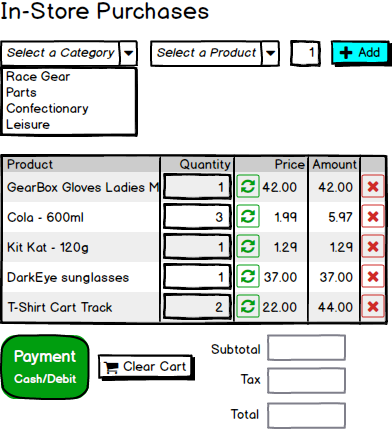
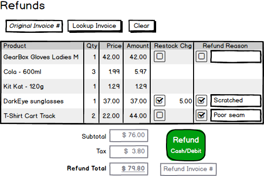
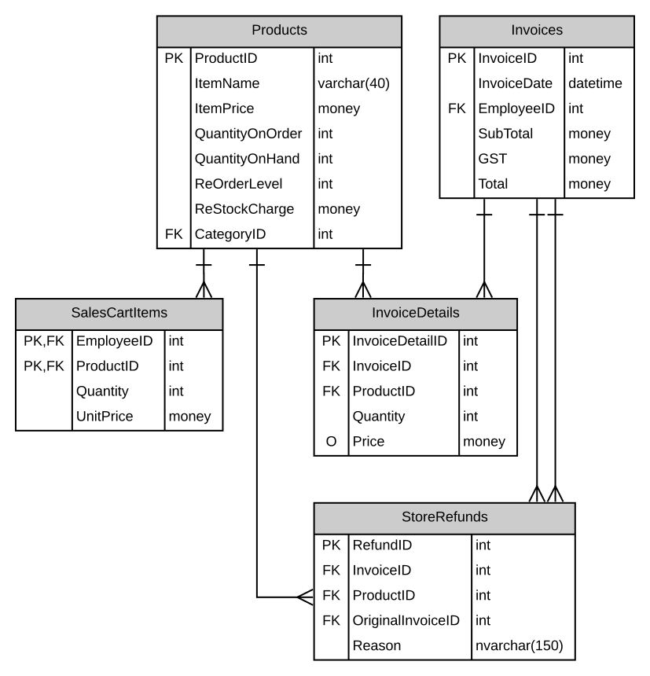

# Sales Subsystem 

> *Employees must log onto the system to access the Sales subsystem. In-Store Sales must only allow authenicated users within the **Clerk** Role to have access to this subsystem. The Employee full name must appear somewhere on the form.*

The Sales subsystem handles all in-store sales of products as well as refunds.

## In-Store Sales

Customers bring products to the counter for in-store purchases and the employee records each item in a sales cart dedicated to the employee's till. Items can be added and removed from the sales cart and the quantities can be edited in the sales cart; refresh the item subtotals when the refresh icon is clicked ().

When the customer pays, the employee clicks the **Payment** button and the entire sales cart is updated and processed as a completed sale. Part of processing the payment is that the sales cart must be emptied for the next customer purchase.

The following rules should be considered in the behavior of in-store sales.

- The category and product drop-downs are to behave as cascading drop-downs.
- All products in the category are shown, even if they already exist in the sales list.
- Re-adding a product already in the list should increase the quantity of that product accordingly (don't show duplicate items in the list of items being purchased).
- Clicking the refresh button for any item updates the quantity for all items in the list.
- Subtotals, tax and grand total are to be re-calculated each time the sales cart is modified.
- When completing the payment, the quantities for each item must be updated as well (the user may have changed the quantities in the form just prior to clicking the **Payment** button)
  - Payment processing is to happen as a single complete transaction.
  - The payment process should include emptying the cart and updating the quantity on hand for the products.
  - Resulting negative values for quantities on hand is allowed (inventory status is updated in a separate stock-counting process at the end of each month).
  - The invoice results are to remain on the screen after the payment is complete. Show the invoice number on the screen as well.
  - Items cannot be added or edited after the payment is processed.
- Clicking the **Clear Cart** button empties the shopping cart and prepares the screen for a new sale.

----

## Refunds/Returns

Customer may bring items back for a refund, provided that they show their original receipt and that they give a reason for each item refunded. Currently, we only accept original-quantity refunds on items returned. Confectionary items are non-refundable.

> ***TIP:** To make your coding easier, improve the autogenerated navigational property names on `Invoice` and `StoreRefund` entities by renaming them according to the [Sales Modifications](../ReadMe.md#Sales-Modifications)

Use the following rules when processing returns.

- Refunds require the original receipt number in order to be processed.
- A refund always results in a new invoice being generated, this time with negative values for subtotal, GST and total.
- Individual item refunds are allowed, but only in the original quantity purchased. Partial item refunds are not allowed.
- A reason has to be supplied for each refund item.
- Confectionary items are non-refundable.
- The refund process is to happen as a single complete transaction.
  - The refund invoice results are to remain on the screen after the refund is complete. Show the invoice number of the refund.
  - The refund cannot be edited after it has been processed.
  - Refunds may be subject to a restocking charge.
  - In-stock inventory quantities need to be updated with all refunds, but the product itself is set aside for later inspection by a manager (who may return it to the supplier in a separate process).
  - If an item on an original invoice has already been returned/refunded, that item cannot be refunded a "second time" (which avoids refund frauds)
- Clicking the **Clear** button clears the screen

----

## ERD

The Sales subsystem uses the following tables in the database. Note that references to `EmployeeID` should be resolved against the logged-in user.

